# The presented examples are in line with EDMtruePLM version 4.0
**Document Release Date : 31/10/2023**

---
---

This document serves as a comprehensive guide to interact with EDMtruePLM"s API for various CRUD (Create, Read, Update, Delete) operations. The API examples provided below demonstrate how users can perform these actions efficiently.

1. Generating a Token:
The first step in interacting with the EDMtruePLM API is to generate an authentication token. This token will be used in subsequent API calls to authenticate the user and grant access to perform operations on the platform.

2. Creating a Project Breakdown Structure:
Once the token is generated, users can proceed to create a project breakdown structure. This involves importing a CAD model in STEP file format. The platform will analyze the CAD model and automatically generate breakdown elements based on its components. These breakdown elements could represent different parts, subassemblies, or even individual objects in the CAD model.

3. Creating Breakdown Elements in the Project:
After the initial breakdown structure is created, users have the flexibility to add or create additional breakdown elements as needed. For instance, if a new component is added to the project or if there are manual modifications required, users can use the API methods to create these new breakdown elements.

4. Searching for Breakdown Elements:
To efficiently manage large projects and datasets, the API provides methods to search for specific breakdown elements based on various parameters. Users can search for elements by name, ID, properties, or other relevant criteria. This ensures easy navigation and access to the required information.

5. Updating User Defined Breakdown Properties:
In some cases, users may need to customize or add specific properties to their breakdown elements to store additional data. The API provides methods to update these user-defined properties, allowing for a more tailored and flexible data structure within the platform.

6. Document Upload, Search, and Delete Methods:
Apart from managing the CAD model and breakdown structure, the API also supports document management within breakdown elements. Users can upload relevant documents related to each element, search for documents, and delete documents when necessary. This feature enhances data organization and makes it easy to associate relevant documentation with specific project components.

In summary, the document provides users with a comprehensive set of API call examples to interact with EDMtruePLM effectively. From generating tokens for authentication to creating project breakdown structures, managing breakdown elements, and handling associated documents, the API methods covered in the examples empower users to perform CRUD operations efficiently and facilitate seamless project management within the platform.

---
---

When running EDMtruePLM as a web application, user can access its Swagger documentation page by navigating to:

`http://localhost:8080/EDMtruePLM/swagger-ui/index.html`

**Important:** Replace `http://localhost:8080` with the appropriate HTTPS-secured domain for production environments.

The API includes the following methods: `POST`, `GET`, `DELETE`, and `PUT` methods, and the responses can be any of the following:

- `200`: {"description": "OK"}
- `401`: {"description": "Unauthorized"}
- `403`: {"description": "Forbidden"}
- `404`: {"description": "Not Found"}

**Note:** The JSON responses containing time information from a REST API are expressed in Coordinated Universal Time (UTC). It"s essential to be aware of the UTC representation in API responses, especially if your application operates in different time zones.

----

This document provides several examples illustrating how to utilize API methods using Python. In these examples, the STEP file `Palfinger_Crane_Assembly_pdm.zip` is employed, and it will be imported into the EDMtruePLM web application as a project identified as `Palfinger_Crane_Assembly`. All the API methods discussed will target this specific project.

The required python libraries to be installed for running the examples are found in requriments.txt.use the command pip install -r requirements.txt

---

## 1. API Call for Generating Token

To utilize the EDMtruePLM REST APIs, a session token is required. The API method `POST` `/api/admin/token` returns a new server connection session token.

### Example of the Output Response

```json
{
  "error": "null",
  "name": "null",
  "token": "VT2MH5XITDBJY9JRLK",
  "use2FA": "false"
}
```

**Required Query Parameters for Generating Token**

To generate a token, user can provide authentication details in one of two ways:

**1. Using API Token:**

   Provide the `api_token` which is generated from the GUI.
   
   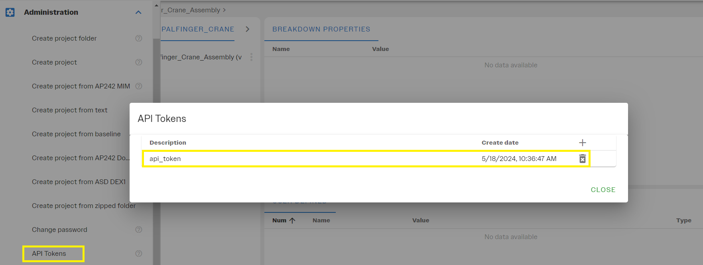

   ```json
   {
     "api_token": "token_string"
   }
   ```
   
**2. Using User Credentials:**

   ```json
    {
       "group": "sdai-group",
       "user": "abc_user",
       "pass": "mypassword"
    }
   ```
In the [`generating_token.py`](/generating_token.py) script, users can find the necessary code to demonstrate the token generation functionality. This script provides a practical example of how to authenticate and obtain a session token using the API.

**Note:** The script relies on a configuration file named `config.json`, which must be located in the same directory as the script. The configuration file should be structured as follows:

```json
{
  "user_name": "",
  "password": "",
  "api_token": "",
  "url": "http://localhost:8080/EDMtruePLM"
}
```
---

## 2. API call for creating new project in EDMtruePLM

The API endpoint for creating a new project is:`POST: /api/adm_user/{token}`

In the Python script [`create_new_project.py`](/create_new_project.py), users will find the necessary code to perform this operation. This script uses the file `Palfinger_Crane_Assembly_pdm.zip` as input for creating a new project. Users are encouraged to substitute their own STEP file to tailor the project creation to their specific needs.

Below is an image showing the project as imported after the API execution:

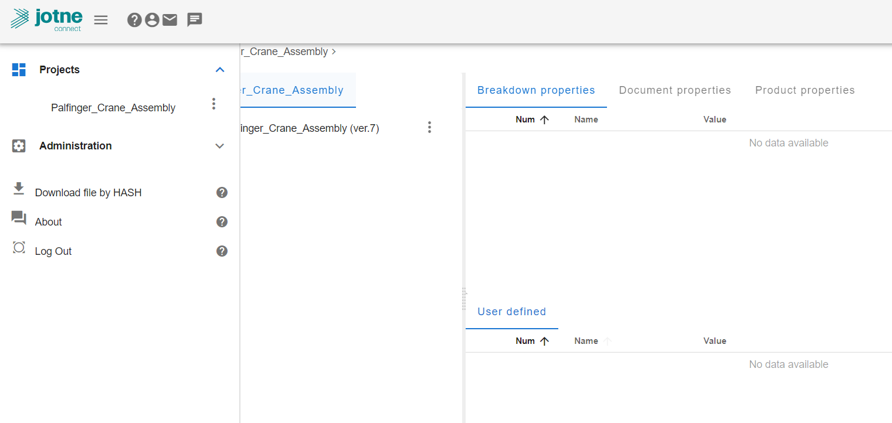


## 3. API call for retrieving the project's root break down element

The API endpoint to retrieve the root breakdown element in a project is:

`GET /api/bkd/{repository}/{model}/{token}`

### Input Path Parameters

This method requires two key input parameters:

- **model**: Specifies the name of the project in EDMtruePLM.
- **repository**: This should be set to `"TruePLMprojectsRep"`, a fixed value for all EDMtruePLM projects.

### Description

When invoked, this API call returns the root breakdown element information for the specified project, providing essential details about the project"s structure in EDMtruePLM.In the Pythonscript [`project_root_bkd_element.py`](/project_root_bkd_element.py), users will find the necessary code to perform this operation.


## 4. API call for creating new breakdown element

This method is utilized in the project to create a new breakdown element within the specified path. 

### API Endpoint

`POST /api/bkd/create/{repository}/{model}/{node}/{token}`

### Usage Details

In this API method, the user needs to specify a path in the form of a node ID. This ensures that the new breakdown element will be created under the specified path. For example, if a user wants to create a new breakdown element named "SENSORS" under the root node of the project, they would specify the root node"s instance ID as the node parameter.

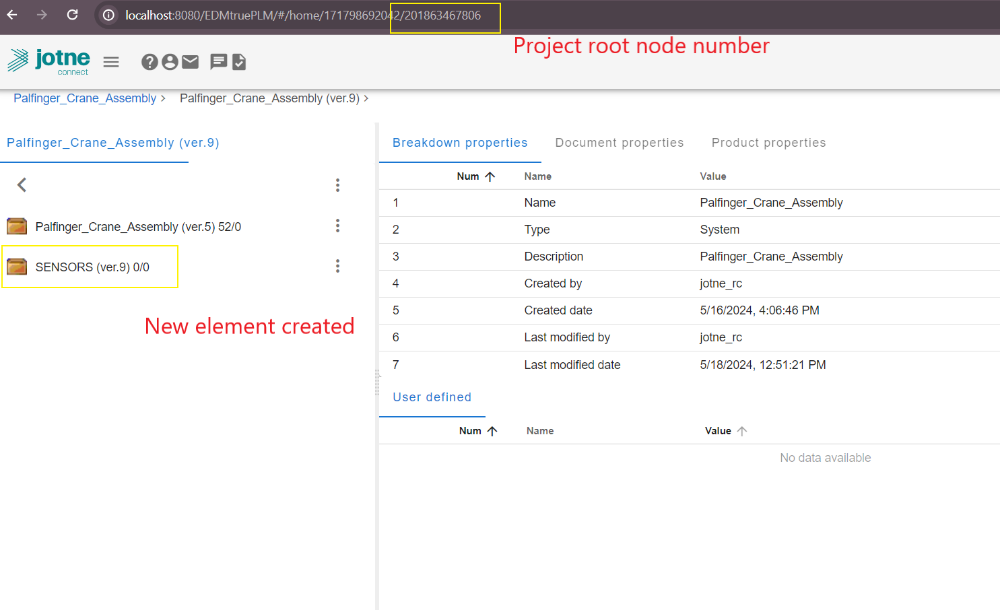

### Important Notes

- **Node Number Usage**: For demonstration purposes, the node number **(instance id)** in these examples is assigned explicitly. However, it is generally advised against using the node numbers directly. Instead, users should employ element search techniques to find the instance ID and then use it in the API call.

- **Instance ID Caution**: Instance IDs should not be considered permanent identifiers, as they may change during operations such as cut/paste and export/import within the project.

In the Pythonscript [`create_new_bkd_element.py`](/create_new_bkd_element.py), users will find the necessary code to perform this operation.

---
## 5.API Calls for Breakdown Elements Quick Search

These API methods facilitate the search of breakdown elements within a project, helping to locate elements and retrieve relevant properties:

### 1. Quick Search for a Single Breakdown Element

- **Endpoint**: `GET /api/bkd/q_search/{repository}/{model}/{token}`


### 2. Extended Quick Search for Breakdown Elements

- **Endpoint**: `GET /api/bkd/q_search_ext/{repository}/{model}/{token}`

- **Response Details**:
  - `page`: The current page number.
  - `page_size`: Number of elements per page.
  - `total_rows`: Total number of elements found with the specified query parameters, showing the scope of the search.
  
### General Usage Notes

In the Python script [`bkd_element_quick_search.py`](/bkd_element_quick_search.py), users will find the necessary code to perform this operation using the following search parameters:

For a comprehensive list of available search parameters and detailed API documentation, please refer to Swagger page.

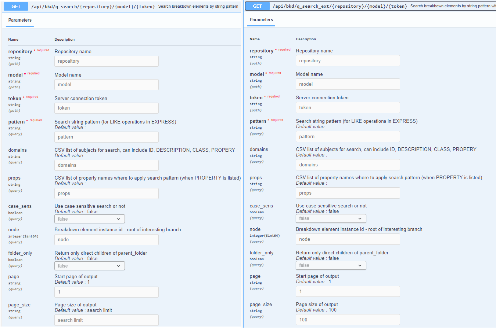

```json
    {
    "case_sens": "false",
    "domains": "ID",
    "folder_only": "true",
    "pattern": "SENSORS",
    "node"   : "201863467806"       
    }
```

- **Node Path**: The `node` **breakdown element instance-id-root of intresting branch parameter specifies** the exact path in the tree where the search for the required breakdown element should be performed, helping to narrow down the search area in a structured and efficient manner.

---

## 6.API call for breakdown element advanced search

### Endpoint
`GET /api/bkd/a_search/{repository}/{model}/{token}`

### Description
This API method is utilized to search for breakdown elements within a project and retrieve detailed information about them. The response is shaped by the query parameters provided, which define the specific attributes of the breakdown elements that are required.


### Query Parameters
- **nodeID** (optional): Specifies the exact path within the project"s tree to locate the desired breakdown element. If omitted, the response will include all breakdown elements that meet the other specified criteria.

### Output
The output of this function provides detailed attributes of the required breakdown element or all elements satisfying the query, depending on the presence or absence of the `nodeID` parameter.

In the Python script [`bkd_element_advanced_search.py`](/bkd_element_advanced_search.py), users will find the necessary code to perform this operation.

---
## 7.API call for deleting breakdown element

### Endpoint
`Delete /api/dat/{repository}/{model}/{node}/{token}`    

This method is used for deleting breakdown element in a project. 
In the below image the user want to delete the **SENSORS 2** breakdown element.

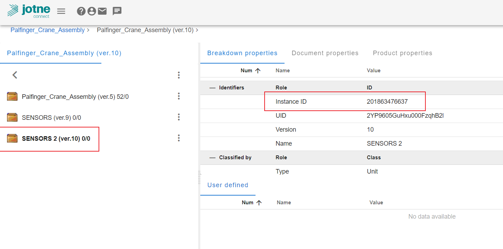


In the Python script [`delete_bd_element.py`](/delete_bkd_element.py), users will find the necessary code to perform this operation.

---

## 8.API call for updating user defined properties of a breakdown element
### Endpoint
`POST /api/bkd/prop/{repository}/{model}/{node}/{token}`

### Description
This method is utilized to update the user-defined property values of a Breakdown element within the Project.

### Procedures

#### 1. Create Reference Data Definitions
Before updating properties for a Breakdown element, users must create the necessary data definitions. These definitions will likely determine the Breakdown element type and the properties it can hold, which may include structures such as Aggregate struct with its elements. For more details, refer to **Section 3.6.6 Reference Data Definitions** in the **EDMtruePLM User Manual**, accessible via the GUI.

#### Managing Breakdown Element Properties in EDMtruePLM

This section outlines the process for assigning types and properties to Breakdown elements within EDMtruePLM, using "Acceleration_type" as an example.

##### Assigning Element Type

The Breakdown element **SENSORS** has been assigned the type "Acceleration_type", as shown in the image below:

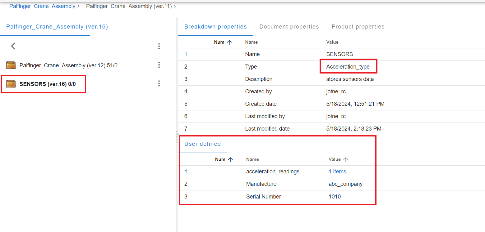

##### Creating Element Type

The "Acceleration_type" is a reference data definition class created using the context menu from the EDMtruePLM GUI, as illustrated here:

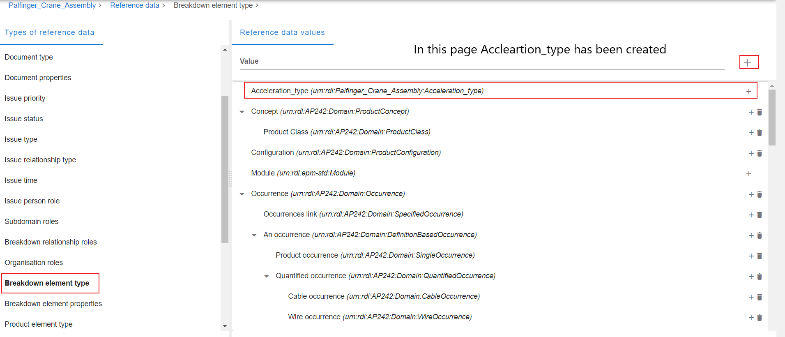

##### Assigning Properties

After creating the "Acceleration_type", properties are then assigned to this newly created type:

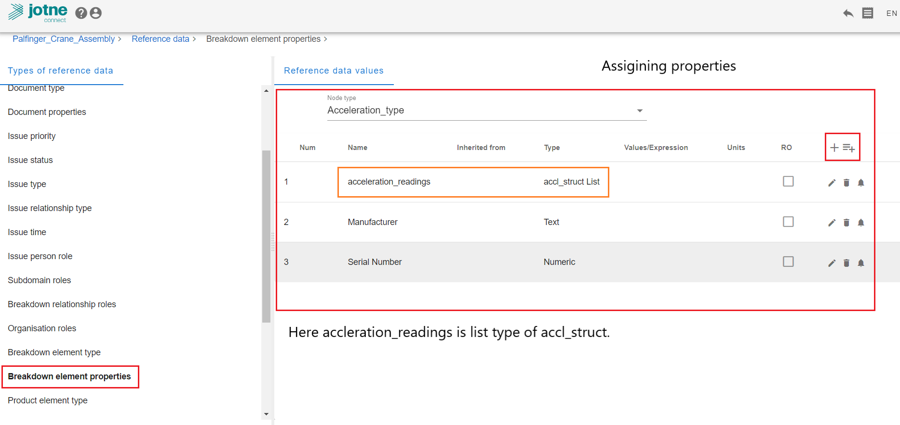

##### Defining Aggregate Structures

Additionally, the aggregate structure, referred to as "accl_struct", is defined on the following page:

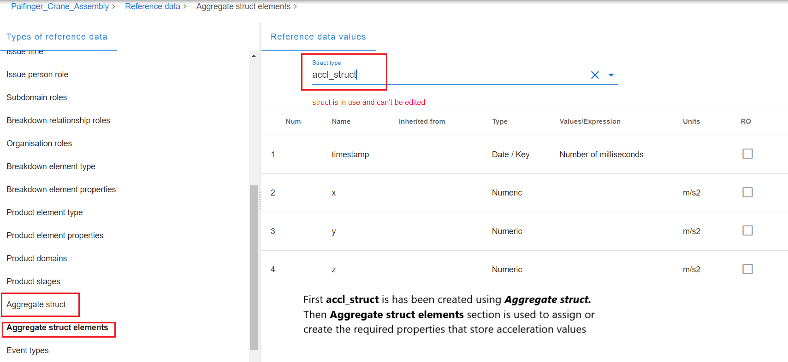

By following these steps, users can effectively manage and customize Breakdown elements within the EDMtruePLM system, enhancing data organization and accessibility.

#### 2. Update User-Defined Properties
After the Breakdown element is established with the required type, users can then proceed to update the element with corresponding values. It"s crucial to ensure the correct units are used when uploading values to each property.

In the Python script [`update_bkd_element_properties.py`](/update_bkd_element_properties.py), users will find the necessary code to perform this operation.

#### The quick search method can be used to obtain information on the user defined breakdown properties.

---
## 9.API call for Retrieving breakdown element children

### Endpoint
`GET /api/bkd/{repository}/{model}/{node}/{token}`

Returns information about the children of a breakdown element with pagination options. This operation is useful for exploring child elements in a hierarchical model structure stored within the specified repository.

### Description
This method retrieves specific breakdown element within the project, or it can be used to obtain detailed information about child elements in a hierarchical tree structure.

In the Python script [`get_bkd_children.py`](/get_bkd_children.py), users will find the necessary code to perform this operation.

---
## 10.API call for uploading Aggregate data to a breakdown element

`POST /api/bkd/aggr/{repository}/{model}/{node}/{prop}/{token}`

### Description

Uploads data in JSON format to the defined the aggregate property struct of a breakdown element. When defining aggregates, if the key field is set to the DATE format, the specified date and time format must be used (as shown in Figure date format). This format is crucial when uploading the data.

### Note

From version 3.6, to filter data using the DATE format, the UNIX millisecond format (e.g., 1686029024000) is required.

`POST /api/bkd/aggr_csv/{repository}/{model}/{node}/{prop}/{token}`

### Description

Uploads data in CSV format to define the aggregate properties for a specific breakdown element. Similar to the JSON upload, if the DATE format is used as a key field in defining the aggregate, the specified date and time format must be adhered to. This format is necessary for the data upload.

### Usage

In the python script [`upload_aggregrate_data.py`](/upload_aggregrate_data.py) provides an example for uploading a JSON formatted acceleration sensor data to the **SENSORS** breakdown element with property `acceleration_readings`. The corresponding JSON file is [`Accleration_readings_data.json`](/files/Accleration_readings_data.json).
 
 In the image below shows the final result of the upload with **2 items**.
 
 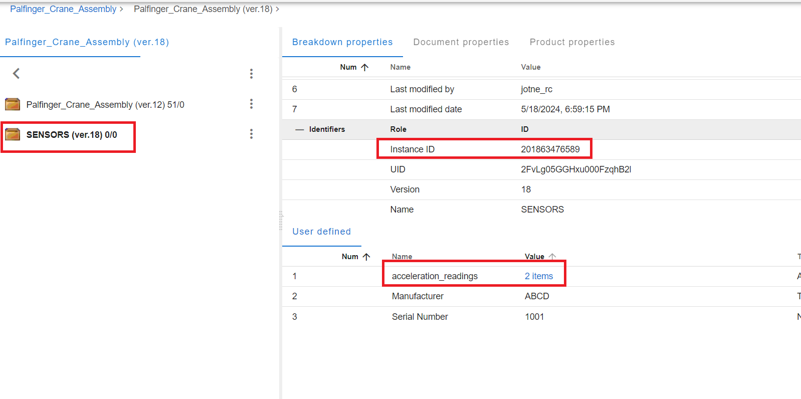

---

## 11.API call to Export aggregate data from breakdown elements 

`GET /api/bkd/aggr_exp_dt/{repository}/{model}/{node}/{prop}/{token} `
Export the values of the aggregated property with paging and filtering to the JSON or CSV format.

In the python script [`export_aggr_exp_dt_method.py`](/export_aggr_exp_dt_method.py) provides the example to retrive the **SENSORS** breakdown element aggregate data in JSON format.

### The other way to exporting aggregate data is :

1.`GET1 /api/bkd/aggr_exp/{repository}/{model}/{node}/{prop}/{token}`Export the values of the aggregated property with paging and filtering to the JSON format

2.`GET /api/dat/file/data/{src}/{name}/{token}`Return file data for download

The first method takes inputs parameters to get data in required format either CSV or JSON . This method will generate 
file properties as shown in below example.

```json
    {"descr": "None",
    "source": "aggr6673349257703198929down",
    "contentType": "None", 
    "discipline": "None", 
    "projPhase": "None", 
    "status": "None", 
    "editor": "None", 
    "resp": "None", 
    "rev": "None", 
    "app": "None", 
    "revMan": "None", 
    "title": "Accleration_readings_data.csv",
    "isNewIssue": "False"}
```
The source and title values are supplied to the second API function from this response.

The example for output response in csv format is shown below

```csv
Timestamp,X,Y,Z

2023-04-11 06:31:04,0,-6,-9
2023-04-11 06:31:05,12,-4,8
2023-04-11 06:31:06,9,7,-9
```
The example for output resposne in JSON  format is shown below 
```json
[{"Timestamp":"2023-04-11 06:31:04","X":"0","Y":"-6","Z":"-9"},
{"Timestamp":"2023-04-11 06:31:05","X":"12","Y":"-4","Z":"8"},
{"Timestamp":"2023-04-11 06:31:06","X":"9","Y":"7","Z":"-9"}]
```
---

## 12.API call for Uploading a file to breakdown element

The method used for uploading a file to a breakdown element is:`POST /api/dat/{repository}/{model}/{node}/{token}`

In the API method node parameter specifies the required breakdown element location under which the required file need to be uploaded.

The below figure shows the result of [`uploading_document.py`](/uploading_document.py) where the [`sample.pdf`](/files/sample.pdf) has been uploaded the required file.

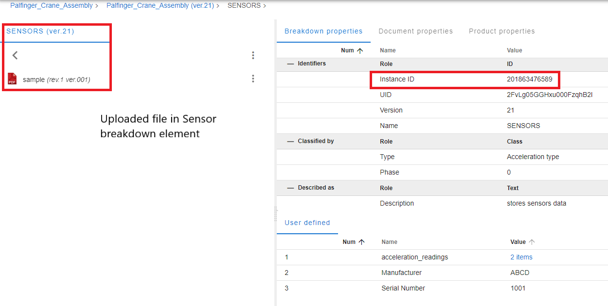

---
## 13.API call for Document from Breakdown elements

### Document File Download Process

This guide outlines the process of downloading a document file from the EDMtruePLM system using a sequence of API calls.

### Overview

The process involves two main steps:
1. Prepare file for the download.
2. Return file data for download.

### Step 1: Prepare File for the Download

`GET /api/dat/file/link/{repository}/{model}/{token}` 

This API method requires the following query parameters to download a required file.
```json
{    
 "name": "sample",      
 "ver": "201863484150"
}
```
The responseof the API call is shown below:

```json

{"descr": "None", "source": "trueplm18262775133753724042.sample", "contentType": "None", "discipline": "None", "projPhase": "None", "status": "None", "editor": "None", "resp": "None", "rev": "None", "app": "None", "revMan": "None", "title": "sample"}
```
### Step 2: Return file data for download

after obtaining file properties, user can download the file:

`GET /api/dat/file/data/{src}/{name}/{token}` which translates to 

`/api/dat/file/data/trueplm18262775133753724042.sample/sample/5V7AX7OE9TMV3AAAJI`

### Example Request

The python file`document_download.py` provide required example.

---
## 14.API call for Deleting Document in Breakdown elements

### Endpoint
`DELETE /api/dat/{repository}/{model}/{doc}/{token}`

### Description
This method is used to delete specific documents within a project. It requires the `ass_doc_instance_id` as an input parameter, which uniquely identifies the document to be deleted.

### Input Parameter
- **ass_doc_instance_id**: The instance ID of the associated document. This ID is crucial for ensuring the correct document is targeted for deletion.

### Obtaining Document Instance ID
The `ass_doc_instance_id` can be retrieved using one of the following search methods:
- **Document Quick Search**: Allows for fast retrieval of document details including instance IDs.[`document_quick_search_method.py`](/document_quick_search_method.py)
- **Advanced Document Search**: Provides a more detailed search capability to find specific documents based on various criteria.[`document_advanced_search_method.py`](/document_advanced_search_method.py)

Below is the JSON resposne from the document quick search method.

```json
    {
    "doc_info": {
      "instance_id": 201863484019,
      "ass_doc_instance_id": 201863484089,
      "file_body_id": 201863483776,
      "size": 49672,
      "linked_to_others": "False",
      "id": "3f3yM05ReHxu000FzqhB2l",
      "description": "test",
      "linked_to_bkdn_elem_instance": 201863484065,
      "versions": [
        {
          "instance_id": 201863484019,
          "version_id": "1.001",
          "changes_description": "First version",
          "status": "urn:rdl:epm-std:Approved",
          "date_submitted": "2024-05-19 08:36:39",
          "submitted_by_user": "jotne_rc",
          "sticky_notes": [
            
          ],
          "affects_documents": [
            
          ],
          "affected_by_documents": [
            
          ],
          "phase": "urn:rdl:epm-std:0",
          "approval": "None"
        }
      ]}
    }
```
### Usage
To delete a document, provide its instance ID along with the repository, model, and a valid token as part of the API request path. Ensure that the instance ID correctly corresponds to the document intended for deletion.

### Example Request

The below figure shows the result of [`delete_document.py`](/delete_document.py) where the **sample.pdf** has been deleted with the API call.

---
## 15.API call for Filtering the aggregate data

### Endpoint

`GET /api/bkd/aggr/{repository}/{model}/{node}/{prop}/{token}`

This API method can utilized to filter the aggregate data in reverse order with paging and filtering with below query parameters.

```json
{
    "from": "First value of the key for filtering. The number of milliseconds has to be used in case of 'Date' type of the key field with specified date format",        
    "to": "Last value of the key for filtering. The number of milliseconds has to be used in case of 'Date' type of the key field with specified date format",
    "page": "1",         
    "size": "1",
    "reverse_order": "true"
}
```

The output of the JSON response is shown below and the python code can be
found in the [`get_aggr_data.py`](/get_aggr_data.py)

```json
 {'urn': 'urn:rdl:Palfinger_Crane_Assembly:acceleration_readings', 'columns': [{'name': 'urn:rdl:Palfinger_Crane_Assembly:timime', 'units': 'None', 'AVG': 0.0}, {'name': 'urn:rdl:Treeadsestamp', 'types': 'urn:plcs:rdl:std:Date_time', 'units': 'None', 'AVG': 0.0}, {'name': 'urn:rdl:Palfinger_Crane_Assembly:x', 'types': 'urn:plcstypes': 'urn:plcs:rdl:TruePLM:Numeric_value', 'units': 'urn:rdl:TruePLM:Numeric_value', 'units': 'urn:rdl:Palfinger_Crane_Assembly:m/s2', 'AVG': 0.0}, {'name': 'urn:rdl:Palfinger_Crane_Assembly:y', 't', 'AVG': 0.0}], 'values': ['1716299280000,45.0,3.634446105ypes': 'urn:plcs:rdl:TruePLM:Numeric_value', 'units': 'urn:rdl:Palfinger_Crane_Assembly:m/s2', 'AVG': 0.0}, {'name': 'urn:rdl:Palfinger_Crane859.0', '1713534360000,42.3591268961589,3.63444610512991,85_Assembly:z', 'types': 'urn:plcs:rdl:TruePLM:Numeric_value', 'units': 'urn:rdl:Palfinger_Crane_Assembly:m/s2', 'AVG': 0.0}], 'values': ['1677763032071,-.7,0.029999999329447746,-0.3499999940395355'], 'page_number': 1, 'page_size': 1, 'rows': 7}
 ```
